# Devlog: our own taskbar, builds b8 to b19

Two days (2026-09-28 and 09-29) spent turning the test-mode taskbar into a 1:1 stand-in for StartAllBack (SAB). The bar and Start menu are drawn straight from SAB's `.msstyles`, so a theme made for SAB should look the same in both. Every change below was checked against SAB side by side where that was possible.

## How it's built and checked

- **One file per build.** `builds/tourne-suite-bN.wh.cpp` is generated from the parts, with its own mod id (`local@tourne-suite-bN`), so a new build installs next to the old one. Settings are copied from whichever build is running, so nothing has to be set up again.
- **A test bar outside Windhawk.** The same code runs as a plain exe (`bartest`), driven by `TB_*` environment variables, so a change can be photographed and compared without touching the live taskbar. `Compare-Matrix` shoots SAB and ours for four styles (Default, Bouquet SAB, Plain8, Windows 7), idle and hovered, and diffs them.
- **Ground truth is a screenshot from the real screen.** Our own BitBlt and DXGI photos show SAB's acrylic areas as copper, which they are not. Colours were measured from real screenshots only.
- Both x64 and x86 are compile-checked for every build.

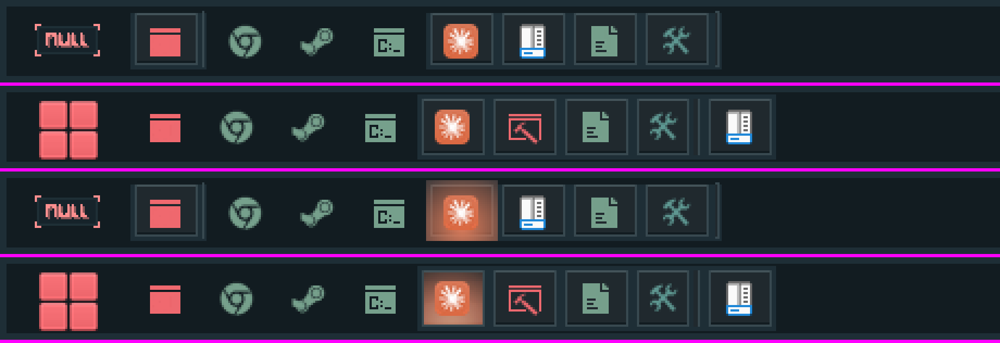

Rows one and three are ours (idle, hovered), rows two and four are StartAllBack. The orb differs only because the test bar doesn't load SAB's orb. The Windows 7 style, same layout:

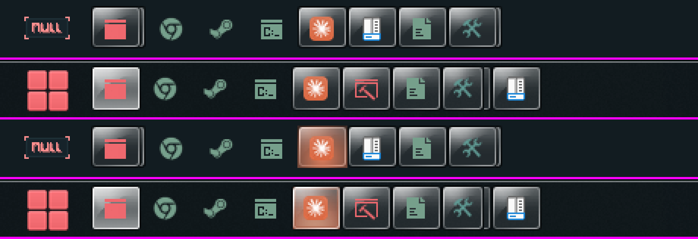

## b8 to b10: matching the look

- **Follows StartAllBack live.** Changing SAB's style, orb or colours now reloads our bar at once. Before, the two drifted apart until a restart.
- **Bar frame.** A 3 px frame (#1E2E36) around the inner #121C21, measured from SAB, kept out of the custom colouring pass.
- **Button frame and glow.** SAB draws a button's frame 28 px high, 4 px in from the side facing the screen's centre, and keeps the hover glow inside it. Ours now does the same, with our own dynamic aura kept on top.
- **Start menu.** Video-frame comparison against SAB: row height 22, right column pitch 29 px, separator moved up 4 px, cue text colour, search focus, and the capitals setting.

## b9 to b11: lightning fast

The complaint was that right clicks and the Start menu felt heavy. What changed:

- The apps list, folder contents and jump lists are read on background threads and cached, and the caches are dropped when settings or pins change. Hovering a button reads its jump list ahead of the right click.
- The Start menu keeps its back buffers and repaints only the rows that changed. Its home rows are built once while idle.
- Windows' own fade and menu animations are switched off for our popups (`DWMWA_TRANSITIONS_FORCEDISABLED`, `TPM_NOANIMATION`), and menu icons are filled in lazily.

## b12 to b14: the details you notice

- **Click a group.** Clicking a button with several windows brings up the last one you used (Ctrl+click still lists them).
- **Tooltips keep their lines.** Multi-line tray tooltips are no longer squashed into one, and the wrongly sized ones are fixed.
- **Menu frame.** Right-click menus and every shell menu and submenu they open get SAB's double frame (a 1 px line, a 6 px band, another line, then the interior), with the row and text colours measured from Bouquet SAB.
- **Menu icons** come from the icon theme's own imageres.dll (pin, shredder, X), and there's a new **End task** entry.
- **Stacked windows.** A group is drawn as a stack, its edge peeking out behind the button, using the theme's own stack parts (13 for a button, 14 for the active one; state 2 for two windows, 3 for more), with a little room so it doesn't run into the next button.

| Flyout menu | The stack parts, from Bouquet SAB |
|---|---|
| 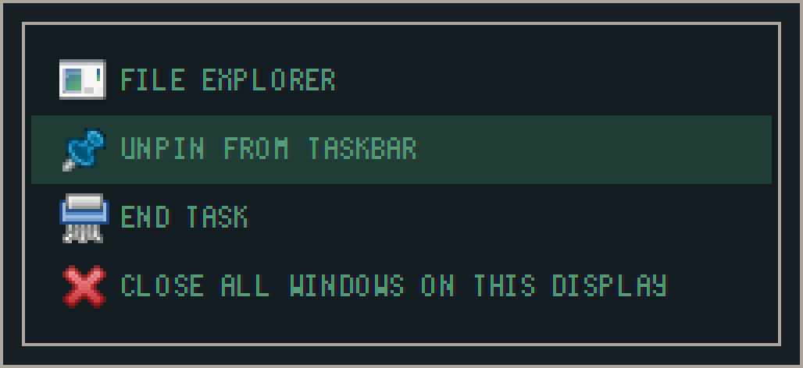 | 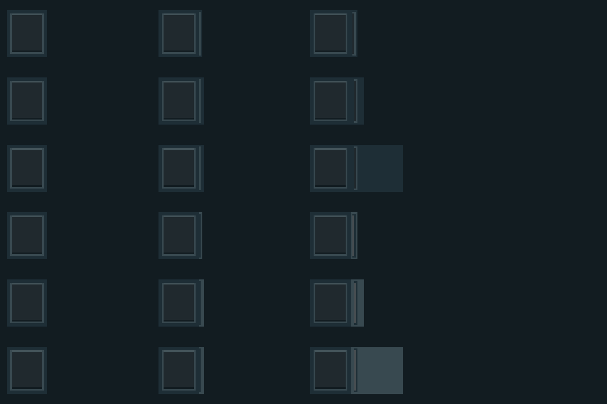 |

The style's band class, as far as it's decoded (every state of every part, drawn from the file with no lock on it):

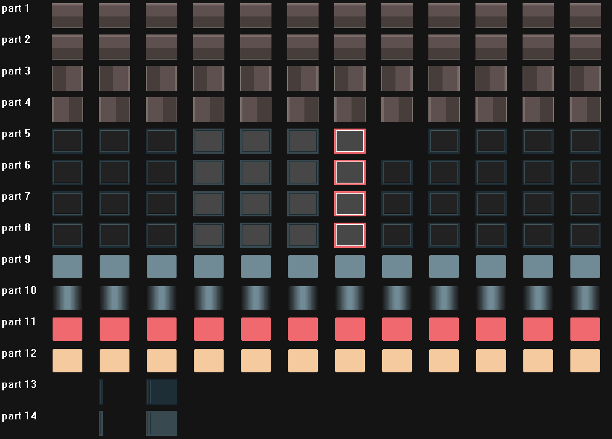

Parts 1 to 4 are the bar background, 5 the button (normal, hot, pressed, active, active hot, active pressed, flashing), 6 to 8 its variants, 9 to 12 the progress bar, 13 and 14 the stack edge.

## What happens with StartAllBack switched off

Our tray already hosts the icons itself (it takes them from the tray notifications directly, not from SAB), and the bar and Start menu are ours. With SAB off, Windows' own taskbar comes back, which "Hide StartAllBack's taskbar" plus "Turn StartAllBack off" handle today. What SAB did to Explorer itself (its restyling) is still open.

## b15: four ideas from studying YASB

YASB (a Windows status bar) has four things worth having. All four are in.

- **A bar per screen.** Every other screen gets a bar with its own windows and the clock. The main bar keeps the Start button, the tray and the watching of windows. Which windows go where follows Windows' "Show taskbar buttons on" (all bars, main plus where open, only where open), and pinned apps stay on the main bar unless Windows shares every button everywhere. New setting: *A bar on every screen* (as Windows is set, always, never). Screens plugged in or removed are picked up live.
- **Hot reload.** Save a theme file, drop one in the Styles or Orbs folder, or change something in StartAllBack, and the bar reloads about 0.4 s later. A burst of changes is one reload.
- **Theme install.** Drop a `.msstyles`, an orb picture, a folder or a `.zip` on the bar, or use *Install a theme or orb...* in its menu. Themes go to `%LOCALAPPDATA%\Tourne\Styles`, orbs to the orbs folder, and a small toast says what was installed.
- **Hover glow fade.** The glow fades in over about 90 ms and out over about 140 ms, from wherever it had got to, like SAB.

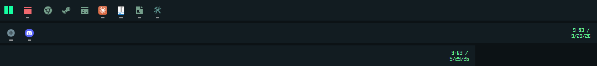

Main bar on top; then the bar of the second screen (a Discord window and one more) and the third (nothing open there yet). Each has its own clock.

**How it's done.** The drawing code works on globals, so each bar keeps its own copy of the few that differ (buttons, hover state, tooltips, tray, layout) and they're swapped in when a message arrives for that bar and out again after, which keeps menus and previews on one bar from confusing another. The test bar turned three screens on and off live, and the hot reload and zip install were run in it too.

## b16: the other screens, finished

The gaps left after b15 are closed, each one tried in the test bar on the three screens:

- **Each screen has its own scale.** Sizes, fonts and the clock are worked out per bar from its screen's DPI, so a 200% screen next to a 100% one gets its own sizes (the scale is a whole number, so 100% and 125% are the same size, as on the main bar). A bar's popups (previews, menus) follow its scale too. Tested by setting one bar to 2x: its buttons came out twice the size and the main bar didn't change; a reload put it back.
- **Menus, dragging, hiding, dialog and drop** all work on the other bars: the button's jump list and the bar's own menu open on that screen and close cleanly; dragging a button saves its order; auto-hide slides a bar to its 2 px edge and back when the pointer reaches it; the install dialog opens and closes; a `.msstyles` dropped on it is installed.
- **Your settings are the defaults.** The build script now takes its defaults from the build that is switched on right now (the highest numbered enabled one) unless told otherwise, so each new build starts from what you use, button icons included.

## Research: can YASB themes be ported?

A YASB theme is a `styles.css` plus a `config.yaml` (which widgets go left, center and right, and their label formats). To see what a port would need, all 68 themes in [amnweb/yasb-themes](https://github.com/amnweb/yasb-themes) were read.

- **Variables are the norm:** 53 of 68 use `:root` custom properties and `var()`; 78% of themes.
- **Popups are most of the CSS.** 39% of rules are about the bar; the rest style popups (calendar, media, control centre) and Qt sub-controls (`::item`, `::groove`), which a bar doesn't need at first.
- **Rare:** gradients (2 themes), `box-shadow` (2), `transition` (11: `background-color` and `opacity`, 0.08 to 0.25 s).
- **They are status bars.** Clock is in all 68, volume in 65, media 58, power menu 56, workspaces 51, weather 48; only 20 show taskbar buttons.
- **Icons are font glyphs** (Nerd Font, Segoe Fluent Icons), so the look depends on the font installed.

Full numbers in `research/YASB-SURVEY.md` in the working folder.

## The CSS spike

A small CSS engine, a config reader and a software renderer, in the same style as the rest of the bar (no libraries, GDI only, x64 and x86):

- `css-engine.cpp`: parser, selectors (classes, descendants, `>`, `:hover` and friends), the cascade with specificity, `var()`, shorthands, gradients, transitions read.
- `css-draw.cpp`: rounded boxes with borders and gradients, text with icon-font fallback, icons.
- `yaml-lite.cpp`: `config.yaml` (block and flow lists and maps, `\uXXXX` escapes).
- `tools/css-spike`: builds YASB's element tree (`.yasb-bar`, `.container-left`, `.widget`, `.clock-widget`, `.widget-container`, `.icon`, `.label`), lays it out like a Qt row and draws it.

Across the 68 themes: all configs and layouts read, 6,551 of 6,908 rules kept (the rest are pseudo-element ones), 99% of 19,445 declarations recognised. Six themes drawn from their own files:

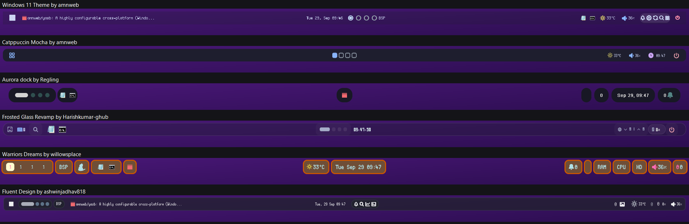

Detail of one (Windows 11 theme by amnweb): the left of the bar, the right, and a hover on a workspace button:

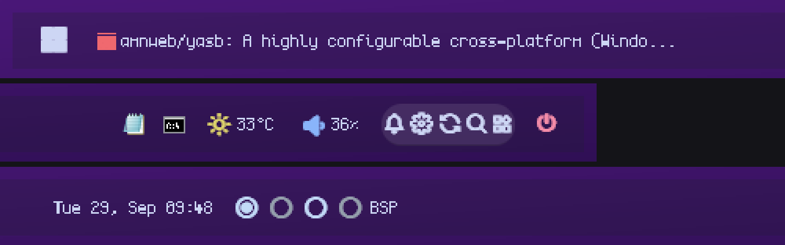

Layout, colours, radii, borders and spacing follow the themes' own screenshots closely. What differs: fonts (icon fonts are different widths from the theme's own), the acrylic blur and rounded window, and real data for the widgets (the spike uses stand-in values). It runs beside the suite for now; it isn't in a build yet.

## b18: YASB themes in the bar (first stage)

The engine is in the bar. Pick a theme under **YASB theme** in the Taskbar settings and the bar is drawn from it.

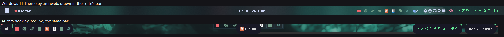

- **Where themes live.** A folder under `%LOCALAPPDATA%\Tourne\Yasb\<name>` with `styles.css` and `config.yaml`. Drop a theme's folder or `.zip` on the bar (or its two files), or use *Install a theme or orb...*; the list fills itself. Saving a file reloads the bar.
- **What the theme decides.** The bar's size, position and padding (it floats off the screen's edge as it does in YASB, with the window as the bar's body, so blur and rounded corners match), the acrylic blur, the widgets in the left, center and right lists, and all their styling, `.dark` and `:hover` included.
- **What stays ours.** The Start button, task buttons (with jump lists, previews, drag), the tray and the clock keep working as they do; they are drawn in the boxes the theme gives them (`.app-container`, `.tray-icon`, `.clock-widget`). Also built: volume (the real level), active window, apps lists, power menu, custom buttons with `start_menu`.
- **Themes without buttons or a tray** (most of them: only 20 of 68 have task buttons) get ours: *Add buttons and tray to YASB themes without them*, on by default, adds task buttons and the Start button at the left and the tray at the right.
- **Commands.** A theme's buttons can name commands (`exec ...`). Those run only if *Let YASB themes run commands* is on (off by default: a theme is someone else's file). Start menu, power menu, notification centre and Windows settings pages always work.
- **Speed.** Building and styling the bar takes 0.2 to 0.5 ms even for the biggest themes (rules are looked up by class).
- **More screens.** Every bar on every screen uses the theme, each at its own scale.

Not there yet: transitions (`:hover` fades), gradients on the bar's window, box shadows, the data widgets (cpu, memory, weather, media, workspaces), popups (calendar, control centre), and `--yasb-*` colours from the system accent. Fonts matter: themes lean on Nerd Fonts, so install the one a theme names.

## b19: get YASB themes from the gallery

**Get a YASB theme...** in the bar's right-click menu opens a small window for the community themes of [yasb.dev/themes](https://yasb.dev/themes). They all live in [amnweb/yasb-themes](https://github.com/amnweb/yasb-themes) on GitHub (one folder per theme with `theme.json`, `styles.css`, `config.yaml` and a screenshot), so the window reads that repository directly.

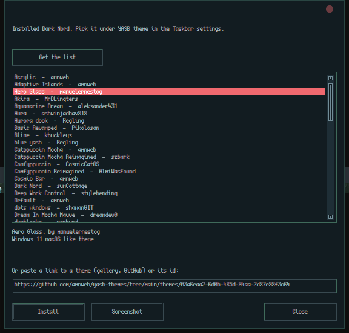

- **Nothing is fetched until you ask.** The window opens empty; *Get the list* reads the folder listing and every theme's `theme.json` (name, author, description), 68 themes in a few seconds, six at a time. *Install* (or a double-click) downloads that one theme's `styles.css`, `config.yaml` and screenshot, and installs it like a dropped theme folder, under the theme's name. The bar picks it up at once; choose it under **YASB theme** in the Taskbar settings.
- **Paste a link instead.** The box takes a theme's gallery link, a GitHub folder or file link, a raw link, a `yasb-themes://` link or the bare id; the id in it is what counts.
- **Screenshot** opens the theme's picture in the browser before installing.
- **Only that repository.** File addresses named inside a `theme.json` are used only if they point into `amnweb/yasb-themes`.
- **Safe at unload.** A download in progress holds the module loaded until it ends. Tried in the test bar against the real repository: the list (68), an install from the list and one from a pasted GitHub link.

Because a theme is someone else's file, its commands still stay off unless *Let YASB themes run commands* is on.

## Small things

- Discord's taskbar button now uses the same pixel chat icon as its tray icon (`Discord.ico` in `%LOCALAPPDATA%\Tourne\Icons`, one more entry in *Button icons* for `Discord.exe`). Claude, GitHub Desktop, Settings and Snipping Tool already had theirs.
- Every build compiles for x64 and x86 (`__stdcall` callbacks fixed for x86).

## Not done yet

- **The other screens' bars were tried in the test bar** (three screens), not yet for long in Windhawk itself. A real 150% or 200% screen hasn't been seen, only a bar forced to 2x.
- The separator SAB draws before the last window's button: the rule isn't known.
- Progress bars on the buttons (parts 9 to 12).
- SVG and `.orb` orbs.
- Explorer restyling when SAB is off.

## b21: smoother dynamic shyness

- **Slides and fades instead of jumping.** The bar used to snap between shown and away. Now Windows' compositor moves and fades the finished bar (no redraw per frame), with frames timed to the screen's refresh: 6.9 ms apart on a 144 Hz screen in the test bar. When it turns back halfway, it continues from where it is.
- **New settings:** Hiding animation (Slide, Fade, Slide and fade, None); Smoothing (Smooth, Soft landing, Gentle, Off); Animation length; Hide delay; Return delay; While hidden (a sliver of the bar like StartAllBack, a soft glow in the accent colour, or nothing), with glow strength and depth.
- **Less flicker.** Windows have to stay clear for the return delay before the bar comes back, and nothing changes while a window is being dragged or resized. Moving the pointer to the screen's edge still brings it back at once.
- **Hidden means out of the way.** While away, the bar ignores clicks, and the blur is turned off under a fading bar or the glow.
- Blurring the bar as it moves (motion blur) was left out. It needs the whole bar redrawn every frame, which costs CPU; moving and fading cost nothing.
- The animation ignores Windows' "Animation effects" setting, since many people turn that off for Windows' own animations. Use None to turn it off.

## b22: progress on buttons, a crash guard, tidier settings

- **Progress bars on task buttons.** Downloads, copies and installers now show their progress on their button, drawn with the style's own progress parts (normal, busy, error, paused). A probe of Windows' own code showed where apps send it: to Explorer's task switcher window, as a state and a value from 0 to 65535. The suite's Explorer side catches it there and passes it to our bar. Busy progress sweeps across the button; that animation runs only while something is busy. Without a style, the colour scheme's accent is used (warning colour for errors).
- **Not yet matched to StartAllBack.** SAB's styles hold thin 42x5 progress strips, and niivu's full Everforest style holds full-button 27x26 ones, so where SAB puts the strip on a button still has to be photographed. The tool for that is ready; it needs an unlocked screen.
- **Crash guard.** If Explorer ends three times within two minutes of starting, the suite stops loading its parts into Explorer and says so on the taskbar. Saving any suite setting lets them back in. Folder windows running in their own Explorer process don't count. It costs one registry read and write when Explorer starts.
- **Safe Mode.** The suite doesn't load at all in Safe Mode.
- **Settings of a part that's off are hidden** (Windhawk 2.0). Each part's options show only while its Enabled switch is on. Windhawk 1.7.3 still installs the build and shows everything.
- The Explorer side now also runs for the taskbar alone (for progress), without System Icons' Explorer work when System Icons is off.
- The test bar can now save the frame it drew without reading the screen, so tests work while the PC is locked.

## Research: what a visual style fills in, and what it leaves out

Every class, part, state and property of 14 styles was dumped with msstyleEditor's own library: Windows' aero and aerolite, Windows 7, Plain8, niivu's Bouquet family (Bouquet, Night, MAC Dark, MAC Night, Bouquet SAB), Everforest Night and Everforest SAB, and the one in use here. Each was compared with aero value by value, with images compared by their decoded pixels. The full map is `research/msstyles/MSSTYLES-MAP.md` in the working folder.

- **Missing usually means inherited.** uxtheme fills a missing value from the part, then the class, then the style's globals, and a missing `App::Class` falls back to the plain class. This was checked against uxtheme itself, not assumed. niivu leaves scroll arrows, combo box dropdown backgrounds and the navigation sizer blank on purpose.
- **What's really left behind** is Windows' accent blue in a few places even finished styles don't repaint: the calendar's cells, dark Explorer's property text and fills, the command bar's split buttons, and dark list expanders. Task Manager's colours are data colours and stay.
- **A style's system colours hold its whole palette.** Bouquet SAB is Plain8 repainted (it kept Plain8's preview and tray arrow images). Everforest SAB is a full style plus the SAB classes. Bouquet and Bouquet MAC differ only in the window frame.

## b24: the style's own tray parts, and its palette

(b23, a SecureUxTheme build, was skipped.)

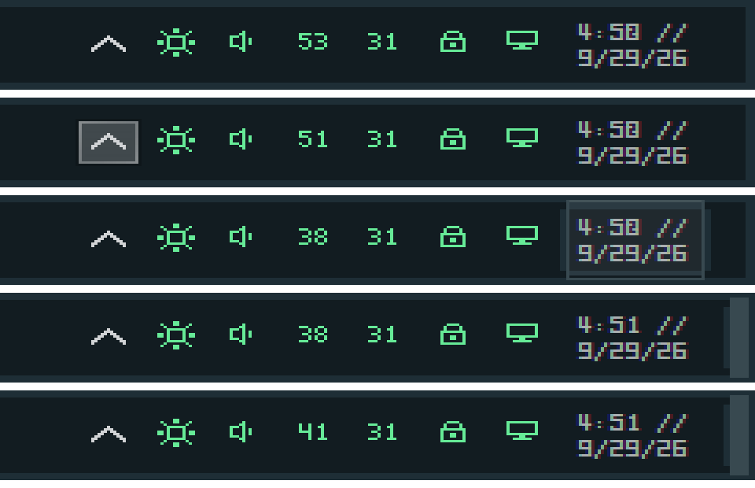

- **The show-hidden-icons arrow** is the style's own (`TrayNotifyHoriz::Button` and its Vert and Open variants), lit when pointed at or pressed. It flips to the Open arrow while the overflow flyout is up.
- **Clock and tray icon hovers** use `TrayNotify::Clock` and `TrayNotify::Toolbar`, as SAB does. The clock's text colour comes from the style too.
- **Show desktop button** at the far end (`ShowDesktop::Button`), sized by the style (10 px in Bouquet SAB, 14 in Windows 7). Clicking it sends Win+D. New setting *Show desktop button*: as Windows is set (the default, Windows' own "show desktop" switch), always or never. **It will appear on this PC**, since that switch is on here, as it does in SAB.
- **Thumbnail previews** are drawn with `TaskbandExtendedUI`: the popup's background, the hovered and flashing window, and the close button. Which part and state is which was worked out from the images; SAB's own previews haven't been compared side by side yet.

  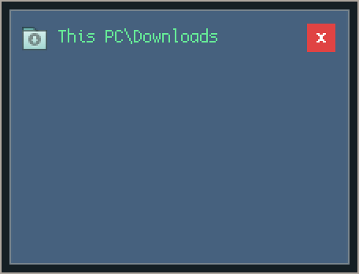

- **Only when the style has them.** A class that only falls back to Windows' plain one (compared by its pixels) is ignored, so styles without SAB's classes keep the old look. Checked: the style in use here, aero and Bouquet MAC Night draw as before; Bouquet SAB, Everforest SAB and Windows 7 get every part.
- **Palette from the style's system colours.** The flat colour scheme taken from a style now starts from its own menu, text, border and grey text colours before the menu's pictures are measured. For the style in use here and every Night style, the palette is unchanged. The light-menu styles (Bouquet Dark and Medium, aero) get a readable faint-text colour, the style's own grey instead of a near-white mix.
- **Windows' blue left in the style** (Theme Gaps, off by default): swaps the accent blues listed in the research for the style's own highlight colour (a darker mix of it for fills). Off, it costs nothing: the hook isn't even put in.
- Nothing forces title bar colours or changes Windows' system colours.
- The test bar's saved frames were upside down (GetObject reports a top-down picture's height as positive), and its preview test never opened a preview. Both fixed.

## b25: Explorer in your colours, and the Windows logo from a folder

### Explorer Colours (new part, off until switched on)

The idea comes from VitalS's [Explorer Visual Tweaks Dark](https://windhawk.net/mods/explorer-visual-tweaks-dark): catch the few theme parts Explorer draws its drive bars, selections and preview pane with, and draw them in your colours. That mod replaces the drive bar with its own rounded gradient, which throws away a style's shape (like the pixel segments here). This part keeps it.

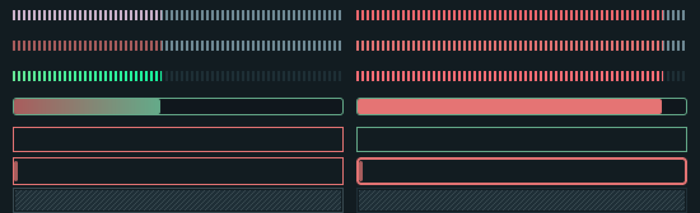

- **Drive bars, three ways.** The style's own; *the style's shape in your colours*; or flat bars (rounding, border, fade). A recoloured bar is the style's own picture drawn aside and remapped by brightness, so its most common colour becomes exactly yours and every segment, gap and shade stays. Separate colours for the filled part, a nearly full drive and the empty part, each with an optional second colour to fade to, and each left as the style's own when empty.
- **Selections** in the file list and the navigation pane (either or both): pointed at, selected, and (new) selected in a window that isn't active, each with its own fill and border; border width 0 to 3 and corner rounding 0 to 6; the navigation pane's focus pill with its own colour and (new) width.
- **Preview pane** background, and plain-text previews, in your colour, with (new) a text colour of your own or one picked to suit.
- **Also in these programs:** their Open and Save dialogs get the same selections and bars.
- **Any colour can be `accent`**, the visual style's highlight.
- **Cost.** Nothing is hooked unless something is on, and each hook checks a part and state number first, then one flag, before it looks at the class. A recoloured bar is two small draws and a pass over its pixels (a drive bar is a few thousand), only when a drive bar is painted.
- Colours start as the ones set in Explorer Visual Tweaks Dark here. Switch the part and the blocks on to use them.
- Checked outside Explorer against the style in use here (`tools/compare/colortest.cpp`). Not yet seen inside Explorer itself.

### Windows branding pictures (Icon Redirect)

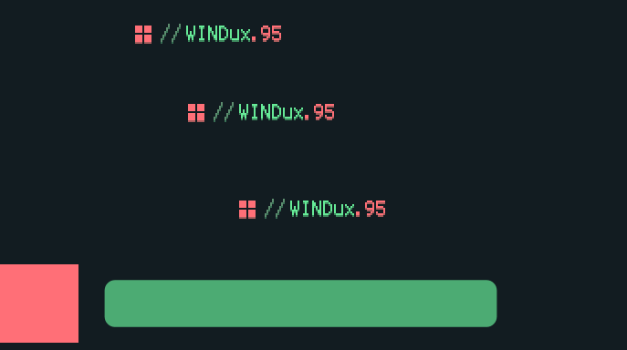

- **Folders of pictures.** A redirect's replacement can now be a folder of pictures named by resource id (`123.png`, `1123.bmp`, `2123.svg`). They stand in for that file's IMAGE, PNG and BITMAP resources. PNGs are used as they are; anything else is converted once, the first time it's asked for, and an .svg is drawn by Windows' own SVG renderer at the size of the picture it replaces. Ids the folder doesn't have stay Windows' own.
- **Windows branding pictures**, one setting: a folder for `Branding\Basebrd\basebrd.dll`, whose 123, 1123 and 2123 are the logo in About Windows (winver), the shut down dialog and System at their three sizes, the ids niivu's packs use. No system file is changed.
- **How it was checked.** `tools/basebrd/brandtest.cpp` compiles Icon Redirect into a test program, points winbrand.dll's own resource calls at its hooks, and asks `BrandingLoadImage` for the logo, which is what winver does. PNG, BMP and SVG all came back at the right sizes.
- **Cost.** Nothing new is hooked (Icon Redirect already reads resources); WIC and Direct2D are loaded only if a .bmp or .svg has to be converted, and never while a DLL is loading.

## b26: a quicker start, and a bar that stays out of the way

Measured in the test bar (warm disk, 3 screens) with timings built into the taskbar; `%LOCALAPPDATA%\Tourne\startup.txt` now logs the same steps on every real start.

### Starting up

- **The rest of the suite no longer waits for the taskbar.** It waited for the whole first setup (650 to 1400 ms); now it waits for the bar's window only (about 12 ms), and the bar sets itself up once its hooks are in.
- **Icons are read once at startup**, not twice (the second read came from a message that arrived after setup).
- **The programs list is read once at startup**, not twice (about 190 ms of background work saved).
- **Not in the lock screen.** The suite no longer loads into LockApp and LogonUI at all.

### The Start menu

| | b25 | b26 |
|---|---|---|
| First open after starting | 190 to 216 ms | about 30 ms |
| Every later open | 21 to 26 ms | about 9 ms |
| First open after a screen change | as slow as the first | about 9 ms |

- **Warmed while closed.** The home list, places, their icons and the right-click menus are made on low-priority threads a few seconds after starting (and after any settings change), so the first open is as quick as the rest.
- **A programs list that didn't change no longer throws the home list away.**
- **Open on press** (on): opens the moment the Start button goes down, as a menu does, instead of when it's let go.

### Screens, sleep and wake

- **Screen changes are gathered up** (a second's wait for waking screens to settle) and redo only the bars' placement, keeping the fonts, style and Start caches: 26 ms instead of a full reload.
- **Theme and colour notices that change nothing are ignored.** Windows sends several on wake; each used to reload everything.
- **Choices are written once**, not 60 times per reload.

### Tooltips and the aura

- **Tooltips:** by the pointer (Windows' place) or beside the bar, centred on the button; moved away from the bar or along it by any number of pixels; their own delay; and closed the moment a preview opens so they never sit over it.
- **The dynamic aura follows at the screen's refresh rate** instead of 15 ms steps, with a *trail* (0 sticks to the pointer; more is a smooth catch-up, as a half-life in ms), plus *size* (40 to 300 %) and *strength* (0 to 300 %) for the Aura style.
- **Cost.** A redraw with the aura following is 0.5 ms, the same as without; the pacer stops when the aura has arrived.

### Window previews, your way

- **How they open:** on resting on a button (as before), on resting on groups only, or only on a click. Ctrl+click now opens any running button's previews, not only a group's. While they're up, moving to another button moves them there.
- **Where:** on the button (as before) or on the pointer, then moved away from the bar or along it by any number of pixels.
- **How long they stay:** until the pointer leaves (after a delay you set, 300 ms as before), or **until dismissed**, in the ways you pick: a click elsewhere, another window coming to the front (not one of theirs), Esc (taken, as a menu takes it), any key (passed on), or a time away. Each can be on or off.
- **After picking a window:** close them (as before), or keep them up to flip between windows.
- **Cost.** The click and key watchers are only in while previews kept until dismissed are up; otherwise nothing is added.
- Checked in the test bar: the offsets and pointer placement land where expected, and the watchers go in and out with the previews.

### Frames and stacks, as StartAllBack draws them

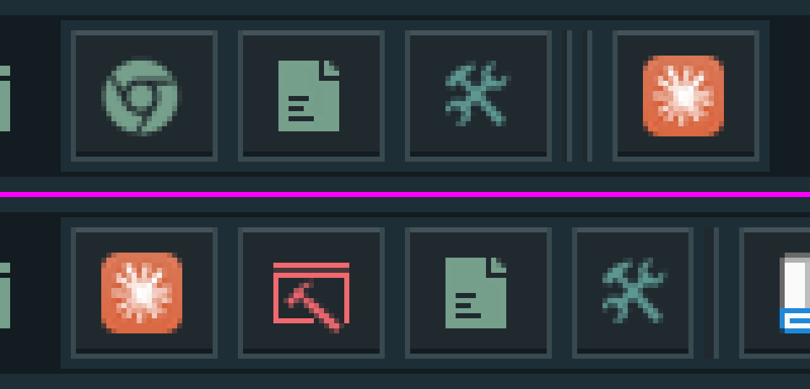

- **The dark outer layer is back.** The colour scheme swaps its tint in for whatever is still the bar's background, and it found that by colour alone. Bouquet's frame border is exactly the bar's colour there, so the frame's two dark outer rows were taken for background and tinted away, leaving the light line at the edge. Drawn pixels are now told apart by alpha as well.
- **Square frames.** Frames are 4 px in from both sides of the bar (30 px on a 38 px bar), as StartAllBack's are, not 28. With the dark rows back, a frame now matches StartAllBack's pixel for pixel.
- **Stacks.** A group's edge is the style's own picture at its own width, right against the frame, as tall as the frame, and one straight line: StartAllBack leaves out the picture's little top and bottom caps, which showed here as hooks. The next button starts right after it (5 px for two windows, 8 for more, read from the picture). Before, it was squeezed to 6 px, so a stack of three or more ran its two edges together.
- **Cost.** Nothing measurable: a redraw is still about 0.5 ms.
### Settings folded at first

Windhawk 2.0 alpha 6 has no way for a mod to ask for folded groups. It remembers what you fold per mod id, and each build here has its own id, so every new build opens unfolded.
### Does switching a part off unload it?

- A part that's off has no hooks: they're removed when the suite reloads. Where no part is on at all, the suite asks Windhawk to unload it from that program.
- Where it is loaded, it costs about 75 KB of private memory per program, plus about 350 KB shared by all of them (the 3.3 MB DLL is mapped once).
- Programs that can't be unloaded into (sandboxed browsers, suspended apps) keep an old build until they close.
