# Tourne'Suite

A work in progress: every way to theme Windows, from Windows 7 to the latest Windows 11 Insider builds, in one place. It's built on [Windhawk](https://windhawk.net/) as one mod made of parts, and every part can be switched on or off on its own.

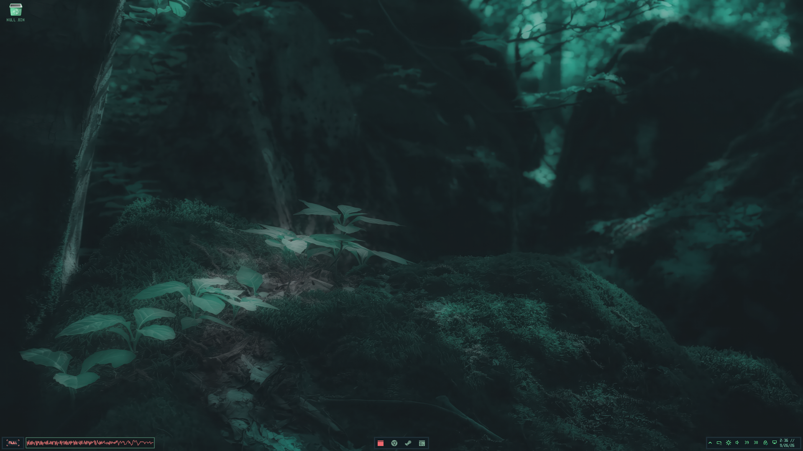

## It starts from what you already have. Every Theme is backwards compatible

- **Your settings are the defaults.** Loading the suite doesn't change your Windows settings. It starts from what you already set, whether in Winaero Tweaker, StartAllBack, Simple Window Switcher or Windows itself. Where nothing was ever set, Windows' own value stays, or nothing is applied.
- **Only what you change is applied**, and only when you change it. Each save applies the values that differ from before, nothing else.
- **It themes itself to your visual style.** Everything the suite draws on its own (the taskbar, its menus and tooltips, the Alt+Tab switcher) follows the `.msstyles` you use and its colours, unless you already have colours of your own set somewhere, like Simple Window Switcher's. Change your theme and they change with it.

## Goals

| Goal | Status |
|---|---|
| **StartAllBack, built from the ground up nothing was stripped/reverse engineered from StartAllBack per its license.** A classic taskbar and Windows 7 style Start menu that work with existing StartAllBack themes | In progress: our own taskbar runs in test mode (see below) |
| **Winaero Tweaker, built from the ground up nothing was stripped/reverse engineered from winaero per its license** | Done: 312 Windows settings as toggles |
| **Window Switcher, built from the ground up** | Done: our own Alt+Tab with all its settings |
| **A SecureUxTheme replacement**, for applying unsigned visual styles | COMPLETE |
| **Various other modifications**: tray icons, flyouts, icon themes, device batteries and more | Working today, Including BYO icons, Including Auto Theme Paletteing shown below |

## What works today

### Taskbar and tray (95% done with the StartAllBack Replacement- Images currently dont reflect, will update soon)

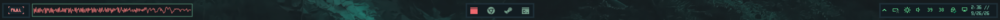

- **System Icons.** Pixel-art tray icons for network, volume, VPN, battery, brightness, notifications, Bluetooth, Windows Security and more, each showing live state.
- **Tray Clock.** Restyles the classic clock.
- **Classic Tray Folders.** Groups tray icons into folders.
- **Change Tray Icons.** Swaps any app's tray icon for a themed one.

### Flyouts

Every tray icon opens its own flyout in the same style, in the spirit of the Windows 7 ones:

| Volume and per-app mixer | Network |
|---|---|
| 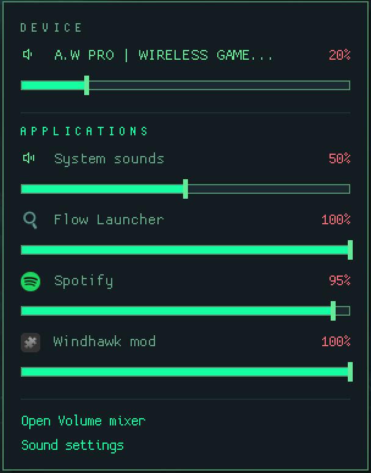 | 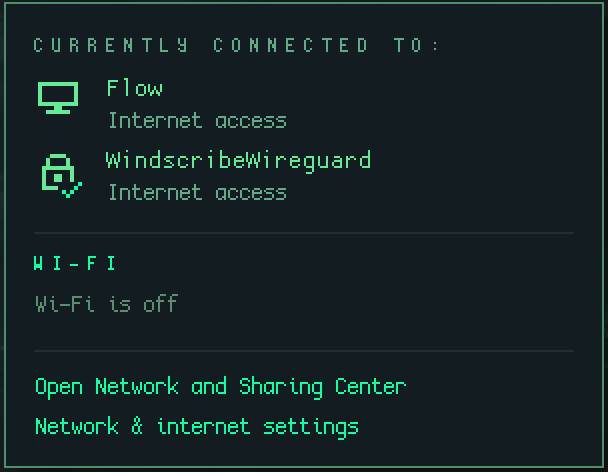 |

| Hidden icons | Device batteries |
|---|---|
| 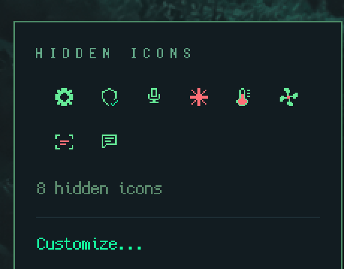 | 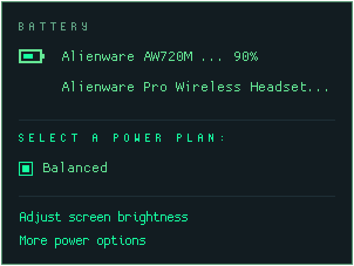 |

There's also a powerplan flyout with laptop powerplans (or if on a desktop, youll see your 2.4gz/dongle and bluetooth device battery %'s here), brightness over DDC/CI, VPN (Windscribe), notifications with a calendar, Windows Security, and Bluetooth with connect and disconnect. Flyouts widen to fit their text automatically, up to a maximum you set.

### Device batteries (Device Support as needed, currently works with the most stubborn, even without their parent programs -> looking at YOU AWCC & Synapse)

Wireless headsets, mice, keyboards and controllers report their battery right in the tray. It reads the level straight from the device, so no vendor app needs to be running. This is a port of HaloBattery (MIT) to C++.

- **Brands:** Alienware, Razer, Logitech, SteelSeries, HyperX, Audeze, MCHOSE, WLmouse, PlayStation and Xbox controllers, plus any Bluetooth device that reports its battery to Windows.
- **Where it shows:** a tray icon per device (the level drawn as a ring around a small picture of the device), inside the existing flyouts, or both.
- **How often:** anywhere from every 5 seconds to every 24 hours (`30sec`, `9min`, `3hr`), and immediately when a device is plugged in or removed.
- **Alerts:** a low battery alert that fires once and waits until the device has been charged before firing again.

### Alt+Tab: the Switcher (95% complete)

Our own window switcher, written from scratch, with every setting a Switcher can have/has: a list or a grid, live thumbnails, macOS-style icon badges, acrylic, see-through backgrounds, rounded or square corners, fonts, grouping by app, colours for dark and light mode, and custom names and icons per program.

It starts from what you already have. If you've used Simple Window Switcher, its colours carry over as they are; otherwise it takes your visual style's colours. There's also a **Style** dropdown with every theme you've installed, the suite's colour schemes, and **Tourne'Style**, the preset shown here.

| Tourne'Style | Grid with icons | Light mode |
|---|---|---|
| 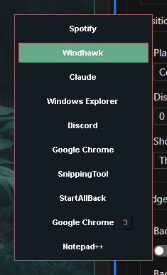 | 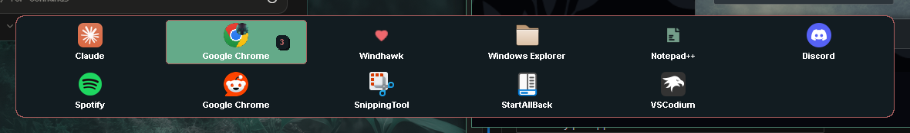 | 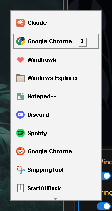 |

With thumbnails, badges and acrylic:

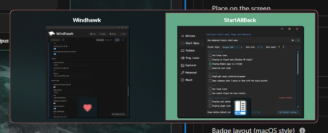

Hold Alt and press Tab as usual. Alt+\` goes backwards or lists only the current app's windows, a Ctrl tap opens an app's entry into its windows, Q or Delete closes one, and Alt+Ctrl+Tab keeps the list open.

### Everything else

- **Icon Redirect.** An icon theme engine written from scratch (MIT), which replaces the Resource Redirect mod. It applies system-wide icon themes and single-app icon swaps.
- **Tweaks.** 312 Windows settings as toggles (Explorer, the desktop, menus, power, privacy and more), applied live where Windows allows it. Turning it on changes nothing: it starts from your PC's current settings, and only the ones you change are applied.
- **Text and menus.** A custom system text colour (including Chrome's menus), and context menus without icons and without duplicate entries.
- **Tourne'Table.** The audio visualizer next to the Start orb.

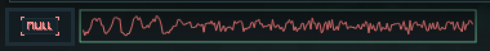

### A tour of the settings

Every part is a group on one Windhawk settings page. **[Watch the two-minute scroll through all of them](video/tourne-suite-settings-tour.mp4)** (no sound and outdated by over 200 individual options).

## In progress: our own taskbar and Start menu

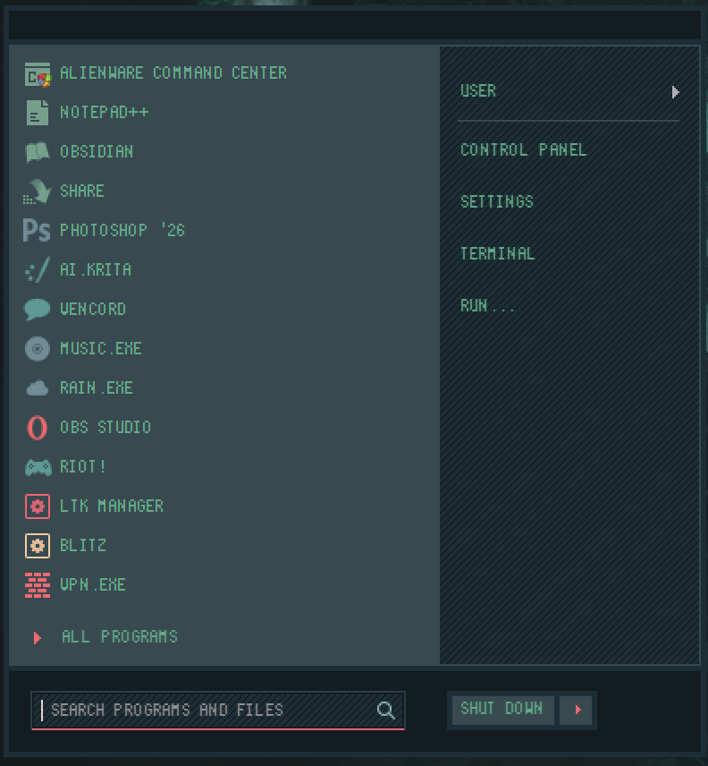

The taskbar and Start menu above are StartAllBack's, styled with the Bouquet SAB theme. The next big piece is our own classic taskbar and Windows 7 style Start menu inside the suite, **drawn straight from StartAllBack themes**, so the themes people already use keep working without StartAllBack.

The suite loads a StartAllBack `.msstyles` and draws every part of it through Windows' own theme engine. Here are the Bouquet SAB taskbar buttons in all their states, plus the progress bar colours and the separators, drawn without StartAllBack running:

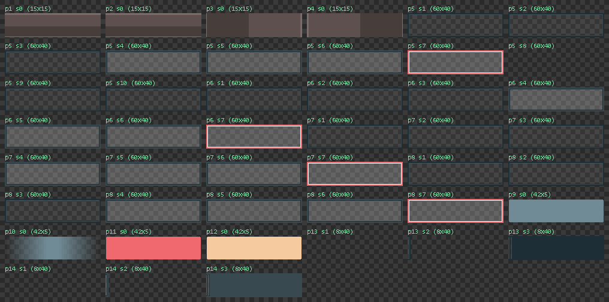

### Our taskbar, in test mode but pretty much complete 1:1 stand in with better options for user choice

It now runs beside StartAllBack's own taskbar while it's tested. Here it is with the Everforest SAB theme:

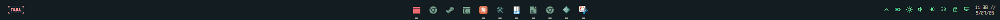

- **Buttons** grouped and ordered the way StartAllBack does it, with the same icons (icon themes included), your pinned apps, and flashing for windows that want attention.
- **The tray** with every icon, placed where you put them, and the clock drawn from the Clock part's settings. Scrolling the volume or brightness icon updates it live.
- **Menus and tooltips** in your theme's own style, or the colour scheme's. They follow when your theme changes.
- **Segments:** the bar can float as up to three islands, with the desktop showing between them.
- **Its theme and orb follow StartAllBack's settings** unless you pick others. Themes can also come from `%LOCALAPPDATA%\Tourne\Styles`, so it works without StartAllBack installed.

**Jump lists.** Right-click a button for the app's tasks, the app itself, pin or unpin, and close. Right-click the app in there for its own Windows menu, with Properties to change its icon:

| Jump list | The app's own menu |
|---|---|
| 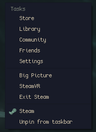 | 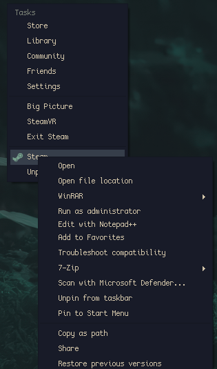 |

**Window previews.** Rest on a button for live thumbnails of its windows. Click one to switch to it, middle-click to close it, or right-click for its window menu:

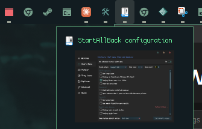

Coming up, in order:

1. Progress bars on the buttons, and recent items in jump lists. (already working)
2. Show desktop and the overflow chevron. (implemented)
3. The Windows 7 style Start menu, including custom styles. (done)
4. A switch that retires StartAllBack. (WIP)

## Credits

- [Windhawk](https://windhawk.net/), which everything runs on.
- The **Bouquet** icon and StartAllBack theme, and the **Everforest** theme, by **niivu**.
- **HaloBattery** (MIT), whose device protocols the battery reader is ported from.
- **Simple Window Switcher** (valinet's sws, and its Windhawk port by Lone), whose settings the Switcher offers. The Switcher's code is our own.
